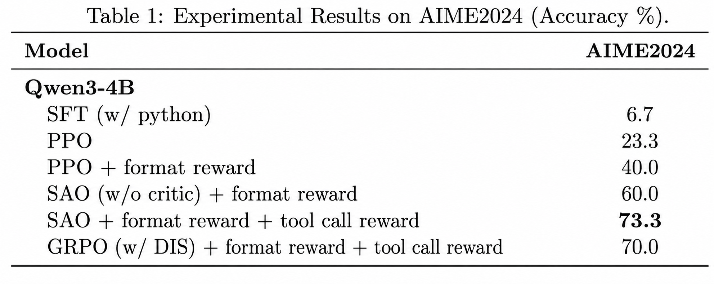

# Agentic RL on Slime 中文说明

中文 | [English](README.md)

本仓库是基于 [slime](https://github.com/THUDM/slime) 的长轨迹大模型强化学习实验版本。框架仍然沿用 slime 的 Megatron + SGLang 训练和推理架构，在此基础上加入了面向 Agentic RL / TIR 任务的异步训练、SAO、critic 预训练、分类 value loss 和 rollout 日志能力。

当前脚本主要面向 Qwen3-4B 的工具集成推理实验。复现实验前，需要根据自己的服务器环境修改脚本开头的模型、数据和日志路径。

## 当前实现

| 模块 | 说明 |
| --- | --- |
| 异步训练流水线 | `train_async.py` 配合 `slime.rollout.fully_async_rollout.generate_rollout_fully_async` 实现 Windowed FIFO 异步 rollout。 |
| 异步 GRPO | 支持 grouped sampling 的 vanilla GRPO baseline。 |
| SAO | 基于 PPO + critic 的 single-rollout 训练，支持 GAE、length-adaptive GAE、skip-observation GAE 和 DIS。 |
| critic 预训练 | 支持正式 RL 前先跑 critic-only 预训练。 |
| 分类 value loss | 支持 `--value-loss-type classification`，包含 two-hot 和 HL-Gauss 两种 target。 |
| vanilla PPO | 通过 `train.py` 启动同步 colocate PPO baseline。 |
| Retool TIR | 支持 Python 工具调用、答案格式奖励、工具调用格式奖励和 JSONL rollout 日志。 |

## 指标结果

这里只展示一张汇总图。完整指标请查看各脚本生成的 TensorBoard 日志。

<p align="center">
  
</p>

## Quick Start

### 1. 配置环境

训练环境需要 Linux、CUDA GPU、Megatron-LM、SGLang、Ray 和 Python 3.12。推荐使用仓库中的 conda 构建脚本：

```bash
bash build_conda.sh
source ~/.bashrc
micromamba activate slime
cd /path/to/this/repo
pip install -e . --no-deps
```

`build_conda.sh` 主要用于安装依赖。正式跑实验前，需要确认当前 Python 环境中 editable 安装的是本仓库这个修改版 `slime`，而不是重新 clone 的上游原版 slime。

如果服务器不能访问 GitHub 或 Docker Hub，可以提前在本地准备 `third_party/*.tar.gz` 第三方源码包，再使用仓库中的 `my_build_conda.sh` 离线安装流程。

环境配置完成后，可以先检查关键包是否能正常导入：

```bash
python -c "import ray, sglang, torch, slime; print('env ok')"
```

### 2. 准备模型权重

当前脚本需要同时提供 HuggingFace 格式 checkpoint 和 Megatron torch distributed checkpoint：

```text
MODEL_DIR=/path/to/qwen3-4b-sft
MODEL_DIR_torch_dist=/path/to/qwen3-4b-sft_torch_dist
```

HuggingFace checkpoint 目录至少应包含：

```text
config.json
tokenizer.json / tokenizer.model
tokenizer_config.json
generation_config.json
```

Megatron torch distributed checkpoint 目录应包含：

```text
latest_checkpointed_iteration.txt
iter_*/ 或 release/
```

Qwen3-4B 脚本中的默认模型路径是：

```bash
MODEL_DIR="/mnt/workspace/models/font-info/qwen3-4b-sft"
```

运行前需要改成自己的实际路径。

### 3. 准备训练和评测数据

Retool/TIR 脚本默认读取 JSONL 数据，每条样本至少包含：

```json
{"prompt": "...", "label": "..."}
```

脚本中的默认数据目录是：

```bash
DATA_DIR="/mnt/workspace/public/data/RLdata/tir"
TRAIN_DATA="${DATA_DIR}/tir_train_data/dapo-math-17k.jsonl"
EVAL_DATA="${DATA_DIR}/tir_val_data/aime-2024.jsonl"
```

每个训练脚本开头都需要重点检查这些路径：

```bash
PROJECT_DIR
DATA_DIR
MODEL_DIR
LOG_DIR
```

### 4. 复现异步 GRPO

入口脚本：

```bash
scripts/run-qwen3-4B-grpo.sh
```

该脚本的核心配置：

- 训练入口：`train_async.py`
- 算法：`--advantage-estimator grpo`
- 异步策略：Windowed FIFO
- 训练卡数：4
- 推理卡数：4
- 每个 prompt 采样 8 条回答：`--n-samples-per-prompt 8`
- rollout batch size：8
- global batch size：64

启动命令：

```bash
ray stop --force || true
bash scripts/run-qwen3-4B-grpo.sh
```

主要输出目录：

```text
qwen3_4b_grpo_checkpoints/
  checkpoints/<exp_name>/
  tensorboards/<exp_name>/
  <exp_name>/rollout_log/
```

常用可调参数：

```bash
--num-rollout
--global-batch-size
--rollout-batch-size
--n-samples-per-prompt
--rollout-max-response-len
--sglang-server-concurrency
--windowed-fifo-max-delay-step
--windowed-fifo-max-prefetch-steps
```

### 5. 复现异步 SAO：critic 预训练 + 正式 RL

SAO 实验分两步：

1. 先预训练 critic。
2. 再加载预训练 critic 启动 SAO/PPO 训练。

#### 第一步：critic 预训练

入口脚本：

```bash
scripts/sao-critic-pretrain.sh
```

该脚本的核心配置：

- 训练入口：`train_async.py`
- actor 学习率为 0
- 全部 step 都是 critic-only 训练
- critic loss：classification value loss
- target 类型：HL-Gauss
- 训练卡数：4
- 推理卡数：4

启动命令：

```bash
ray stop --force || true
bash scripts/sao-critic-pretrain.sh
```

critic 预训练 checkpoint 默认保存到：

```text
qwen3_4b_checkpoints/checkpoints/sao-classify-pretrained-critic/critic
```

#### 第二步：正式 SAO 训练

入口脚本：

```bash
scripts/run-qwen3-4B-sao-fifo.sh
```

该脚本的核心配置：

- 训练入口：`train_async.py`
- 算法入口：`--advantage-estimator ppo`
- 异步策略：Windowed FIFO
- 每个 prompt 只采样一条轨迹：`--n-samples-per-prompt 1`
- 使用 critic baseline
- 使用 DIS：`--use-dis`
- 使用 length-adaptive GAE：`--enable-length-adaptive`
- 跳过 observation token 做 GAE：`--skip-observation-gae`
- 使用 classification critic：`--value-loss-type classification`

正式 SAO 脚本默认从这里加载预训练 critic：

```bash
PRETRAINED_CRITIC_DIR="${LOG_DIR}/checkpoints/sao-classify-pretrained-critic/critic"
```

启动命令：

```bash
ray stop --force || true
bash scripts/run-qwen3-4B-sao-fifo.sh
```

主要输出目录：

```text
qwen3_4b_checkpoints/
  checkpoints/<exp_name>/actor/
  checkpoints/<exp_name>/critic/
  tensorboards/<exp_name>/
  <exp_name>/rollout_log/
```

续训逻辑：

- 如果 `actor/latest_checkpointed_iteration.txt` 和 `critic/latest_checkpointed_iteration.txt` 都存在，脚本会从 actor/critic 分目录续训。
- 如果只存在 actor 或只存在 critic，脚本会直接退出，避免 actor 和 critic checkpoint 状态不一致。
- 如果两个目录都不存在，actor 从 `${MODEL_DIR}_torch_dist` 初始化，critic 从 `PRETRAINED_CRITIC_DIR` 初始化。

SAO 相关的重要参数：

```bash
--use-dis
--dis-clip
--dis-clip-low
--critic-lr
--critic-update-ratio
--critic-freeze-params-name-list
--value-loss-type classification
--value-num-bins
--value-reward-range
--value-target-type hl_gauss
--hl-gauss-sigma-ratio
--update-weights-interval
```

### 6. 复现 vanilla PPO

入口脚本：

```bash
scripts/run-qwen3-4B-vanillappo.sh
```

该脚本的核心配置：

- 训练入口：`train.py`
- 算法：`--advantage-estimator ppo`
- 同步 rollout/train 流程
- colocate 模式：`--colocate`
- actor 卡数：8
- rollout batch size：32
- global batch size：32

启动命令：

```bash
ray stop --force || true
bash scripts/run-qwen3-4B-vanillappo.sh
```

主要输出目录：

```text
qwen3_4b_vanillappo_checkpoints/
  checkpoints/<exp_name>/
  <exp_name>/tensorboards/
  <exp_name>/rollout_log/
```

如果需要同步 PPO baseline，而不是 Windowed FIFO 异步流水线，应使用该脚本。

### 7. 查看 TensorBoard

SAO 和 critic 预训练：

```bash
tensorboard --logdir qwen3_4b_checkpoints/tensorboards --host 0.0.0.0 --port 6006
```

vanilla PPO：

```bash
tensorboard --logdir qwen3_4b_vanillappo_checkpoints --host 0.0.0.0 --port 6006
```

GRPO：

```bash
tensorboard --logdir qwen3_4b_grpo_checkpoints/tensorboards --host 0.0.0.0 --port 6006
```

常用 TensorBoard 指标：

| 指标组 | 含义 |
| --- | --- |
| `train/*` | PPO/GRPO loss、policy loss、entropy、critic loss、DIS/TIS 指标。 |
| `rollout/*` | 训练 rollout 的 reward、长度、工具调用次数、KL、staleness 和队列状态。 |
| `eval/*` | 评测集 reward、accuracy、工具调用次数和 compaction 统计。 |
| `perf/*` | rollout 时间、actor 训练时间、logprob 时间、token 吞吐等性能指标。 |

rollout 和 eval 的文本日志保存为 JSONL：

```text
<LOG_DIR>/<EXP_NAME>/rollout_log/rollout_outputs/rollout_<step>.jsonl
<LOG_DIR>/<EXP_NAME>/rollout_log/eval_outputs/eval_<dataset>_<step>.jsonl
```

这些 JSONL 文件用于检查模型实际输出、工具调用、答案解析、reward 字段、截断状态和 compaction 信息。

## 脚本索引

| 实验 | 脚本 | 入口 | 说明 |
| --- | --- | --- | --- |
| 异步 GRPO | `scripts/run-qwen3-4B-grpo.sh` | `train_async.py` | Windowed FIFO + grouped sampling。 |
| critic 预训练 | `scripts/sao-critic-pretrain.sh` | `train_async.py` | critic-only 训练，classification value loss。 |
| 异步 SAO | `scripts/run-qwen3-4B-sao-fifo.sh` | `train_async.py` | PPO + critic + DIS + Windowed FIFO。 |
| vanilla PPO | `scripts/run-qwen3-4B-vanillappo.sh` | `train.py` | 同步 colocate PPO baseline。 |
| checkpoint 评测 | `scripts/eval-qwen3-4B-vanillappo-checkpoint.sh` | `train.py` | eval-only checkpoint inference。 |
| SFT 检查 | `scripts/debug-infer-qwen3-4B-sft.sh` | `train.py` | 检查 SFT checkpoint 是否能正常生成。 |

## DLC / 多节点 Ray 启动

如果在 DLC 或多节点环境提交任务，可以用 `scripts/ray.sh` 作为外层启动脚本，再通过 `SCRIPTS` 指定真正执行的训练脚本：

```bash
export WORK_DIR=/mnt/workspace/wangdy/code/zj-slime-0722
export NNODES=1
export N_GPUS_PER_NODE=8
export SCRIPTS=run-qwen3-4B-sao-fifo.sh
export EXP_NAME=sao-classify-critic-pretrain

bash /mnt/workspace/wangdy/code/zj-slime-0722/scripts/ray.sh
tail -f /dev/null
```

`ray.sh` 会读取环境变量中的 `WORK_DIR`，启动或加入 Ray 集群，并从项目的 `scripts` 目录执行 `${SCRIPTS}`。

## 常见注意事项

- 运行前必须修改脚本中的 `PROJECT_DIR`、`DATA_DIR`、`MODEL_DIR` 和 `LOG_DIR`。
- HuggingFace checkpoint 和 `${MODEL_DIR}_torch_dist` 必须对应同一个模型。
- classification critic checkpoint 不能直接和 MSE critic head 混用，除非明确重新初始化 value head。
- SAO 续训时 actor 和 critic 的 checkpoint step 必须一致。
- `--rollout-max-response-len` 控制 Retool rollout 的生成长度和上下文预算。
- `--max-tokens-per-gpu` 控制 Megatron 动态 batch 的单卡 token 容量，不是 SGLang KV cache 大小。
- 如果 SGLang 出现 KV cache 压力，应降低 `--sglang-server-concurrency`、降低最大生成长度，或提高 rollout 侧显存比例。
- 如果 Ray job submission 因旧 Ray 集群失败，先执行 `ray stop --force` 再重新启动。

## 致谢

本项目基于原始 slime 框架的 Megatron + SGLang 训练推理链路开发。当前仓库新增的训练逻辑和实验脚本主要用于复现和对比 Agentic RL 中的 GRPO、PPO、SAO、critic 预训练和 classification value loss。
